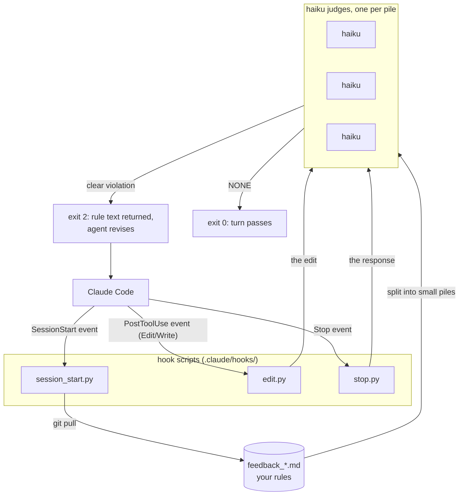

# hook-based-feedback

This repo is a starter kit for making a Claude Code agent enforce your feedback on itself.
It is for anyone running Claude Code who keeps giving the agent the same corrections
and wants them to stick across sessions.

Feedback is a correction written as a `feedback_<slug>.md` file.

```markdown
---
name: Claude, you made a mistake
description: Description of mistake
type: feedback
---

Don't make this mistake again: ....
```

After setting this up you will have some feedback as a quickstart:

- Validate agent claims against docs or source
- No leaving "open questions" in output if the agent can find out the answer
- Only write code comments when explicitly asked

## Hooks

A hook is a script Claude Code runs on a lifecycle event. This quickstart uses `SessionStart`,
`PostToolUse`, and `Stop` hooks. You can add more. See the
[Claude hooks reference](https://code.claude.com/docs/en/hooks) for a list of all configurable
hooks.

## Architecture

Claude Code fires lifecycle events. Hooks route those events to scripts.
The scripts hand the agent's output plus your `feedback_*.md` rules to small
haiku judges. A clear violation blocks the turn and the rule text goes back
to the agent, which must revise.



For efficiency, an optional daemon maintains a warm pool of these judges,
pre-booted and pre-primed with the rules.
See [tools/warm_judge](tools/warm_judge/README.md).


## Setup

Hand [AGENT_INSTRUCTIONS.md](AGENT_INSTRUCTIONS.md) to your agent. It wires these hooks into
your project's `.claude/settings.json`, and adds rules and checks on request.
