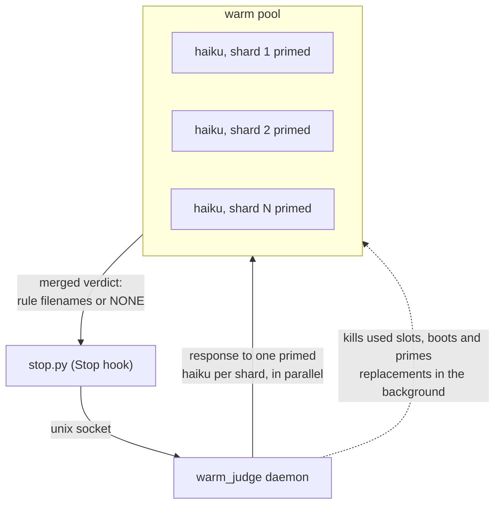

# warm_judge

A daemon that keeps pre-warmed haiku judge sessions ready, one per rule
shard, so the Stop hook gets its verdicts from already-primed sessions
instead of cold-starting a `claude` process per shard.

## Why

Every stop, the judges must read your feedback rules plus the response.
The rules are split into shards of 12 files because a small model judging
a short list of rules is far more accurate than one skimming a long list.
Cold, each stop spawns one `claude -p` process per shard, about 5s boot
each, and pays to process the shard text and the shared context every time.
Measured on a 104-rule setup, the cold path takes about 26s per stop.

Warm, each shard's rules are sent once as a priming turn when its slot
boots. The Anthropic prompt cache keys on the prompt bytes, so every later
slot priming with the same shard reads the cache instead of reprocessing.
A sharded warm judgment measured 21 to 22s on a throttled account, similar
wall clock to cold. The reliable wins are cost, nothing gets reprocessed at
full price, and no 9-process boot storm on every stop.

## How it works



1. `serve` splits the `feedback_*.md` files into shards of 12 and boots one
   `claude -p --input-format stream-json` haiku session per shard. Each gets
   a priming turn with its shard's rules, replies READY, and waits.
2. The Stop hook sends the finished assistant response over a unix socket.
3. The daemon takes one primed slot from every shard, sends the response to
   all of them in parallel, and merges the verdicts, violated rule filenames
   or NONE.
4. Used sessions are killed. Replacements are booted and primed in the
   background, off the critical path, so the next stop finds warm slots.
5. Slots older than 15 minutes are recycled so rule edits get picked up.
6. After 30 minutes with no judgments the daemon exits.

Sessions are used for exactly one judgment. That keeps every verdict
independent, with no conversation history bleeding between judgments.

## Usage

Start the daemon (from the project the hooks run in, so it finds the same
memory dir):

```
python3 tools/warm_judge/warm_judge.py serve &
```

The Stop hook in `hooks/stop.py` checks for the daemon's socket on every
stop. Daemon running: warm path. Daemon absent or erroring: it falls back
to the original cold sharded path. No configuration needed.

Other commands:

```
python3 warm_judge.py status                      # pool state
python3 warm_judge.py judge --response "text"     # manual judgment
python3 warm_judge.py stop                        # shut down
```

`AGENT_MEMORY_DIR` or `CLAUDE_PROJECT_DIR` control which rules directory is
loaded, same resolution as the hooks.

## FAQ

**Is the pool per Claude session or per device?**

Per rules directory, shared across the device. Every Claude session on your
machine that uses the same rules directory talks to the same daemon and the
same pool. A different project gets a different socket, so it needs its own
daemon.

**Can any Claude session claim slots?**

Yes. Slots belong to the daemon, not to any session. The first stop to ask
takes one primed slot from every shard. If two sessions stop at the same
moment, the second falls back to the cold path for that turn. Raise
`--spares` if you run several sessions in parallel.

**Can any slot judge any rule file?**

No. Each slot knows one shard of 12 rules, kept small so haiku stays
accurate. A stop claims one slot from every shard in parallel, so each
judgment still covers every rule. A new or edited rule reaches the pool when
slots turn over, after one use or at the 15 minute age limit.

**Does the warm pool cost more than cold spawns?**

No. Each stop costs less warm, because cached judgments replace cold
processes that each reprocess everything at full price. The only extra cost
is keeping the spare slots fresh while nothing happens, one small request
per slot per 15 minutes. The daemon exits after 30 idle minutes, so that
burn stops when you walk away.

## Costs

Each priming turn is a real billed request. The first one writes its shard
to the prompt cache, refills mostly read it back at cache-read rates. Each
recycled or refilled slot is one small request, and a 104-rule setup keeps
9 slots per spare. Keep `--spares` at 1 unless stops arrive faster than one
judgment finishes.

Per stop, the warm path is cheaper than the cold path, because the cold
path's parallel spawns each reprocess the shared context at full price
while warm judgments read it from cache. The standing cost is the 15 minute
recycle while the daemon idles. To cap it, the daemon shuts itself down
after 30 minutes with no judgments. The session-start autostart brings it
back on the next session.
